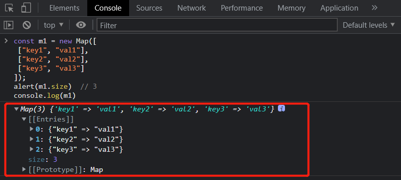
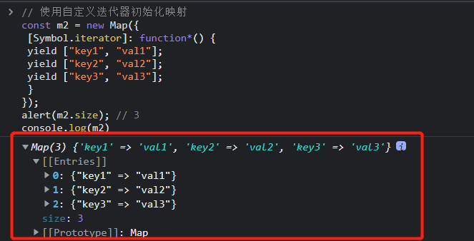

#### 什么是map

Map是ECMAScript 6 的新增特性，是一种新的集合类型，为javascript带来了真正的键/值存储机
制。

* Map 对象存有键值对，其中的键可以是任何数据类型。

* Map 对象记得键的原始插入顺序。

* Map 对象具有表示映射大小的属性。

#### Map的基本API

##### 1、new Map() 创建新的 Map 对象
使用 new 关键字和 Map 构造函数可以创建一个空映射：
```javascript
// 创建新的 Map 对象。
const m = new Map();
```

如果想在创建的同时初始化实例，可以给 Map 构造函数传入一个可迭代对象，需要包含键/值对数
组。**可迭代对象中的每个键/值对都会按照迭代顺序插入到新映射实例中**：

```javascript
const m1 = new Map([ 
 ["key1", "val1"], 
 ["key2", "val2"], 
 ["key3", "val3"] 
]); 
alert(m1.size)  // 3
console.log(m1)
```
console打印出的m1如下：


使用自定义迭代器初始化映射
```javascript
// 使用自定义迭代器初始化映射
const m2 = new Map({ 
 [Symbol.iterator]: function*() { 
 yield ["key1", "val1"]; 
 yield ["key2", "val2"]; 
 yield ["key3", "val3"]; 
 } 
}); 
alert(m2.size); // 3
console.log(m2)
```
console打印出的m2如下：


##### set()、 get()、has()、delete()、clear()
初始化之后，可以使用 set()方法再添加键/值对。另外，可以使用 get()和 has()进行查询，可
以通过 size 属性获取映射中的键/值对的数量，还可以使用 delete()和 clear()删除值。

* set()方法再添加键/值对
* get()获取 Map 对象中键的值
* has()进行查询
* delete()删除一个键/值对
* clear()清除这个映射实例中的所有键/值对

```javascript
const m = new Map(); 
alert(m.has("firstName")); // false 
alert(m.get("firstName")); // undefined 
alert(m.size); // 0 
m.set("firstName", "Matt") 
 .set("lastName", "Frisbie"); 
alert(m.has("firstName")); // true 
alert(m.get("firstName")); // Matt 
alert(m.size); // 2 
m.delete("firstName"); // 只删除这一个键/值对
alert(m.has("firstName")); // false 
alert(m.has("lastName")); // true 
alert(m.size); // 1 
m.clear(); // 清除这个映射实例中的所有键/值对
alert(m.has("firstName")); // false 
alert(m.has("lastName")); // false 
alert(m.size); // 0
```
**set()方法返回映射实例，因此可以把多个操作连缀起来，包括初始化声明：**
```javascript
const m = new Map().set("key1", "val1");
m.set("key2", "val2")
    .set("key3", "val3");
alert(m.size); // 3
```
与 Object 只能使用数值、字符串或符号作为键不同，Map 可以使用任何 JavaScript 数据类型作为
键。

```javascript
const m = new Map(); 
const functionKey = function() {}; 
const symbolKey = Symbol(); 
const objectKey = new Object(); 
m.set(functionKey, "functionValue"); 
m.set(symbolKey, "symbolValue"); 
m.set(objectKey, "objectValue"); 
alert(m.get(functionKey)); // functionValue 
alert(m.get(symbolKey)); // symbolValue 
alert(m.get(objectKey)); // objectValue
```

#### Map的顺序与迭代
与 Object 类型的一个主要差异是，Map 实例会维护键值对的插入顺序，因此可以根据插入顺序执
行迭代操作。
Map映射实例可以提供一个迭代器（Iterator），能以插入顺序生成[key, value]形式的数组。

##### entries() 返回 Map 对象中键/值对的数组。
Map映射实例提供一个迭代器（Iterator），能以插入顺序生成[key, value]形式的数组。可以
通过 entries()方法（或者 Symbol.iterator 属性，它引用 entries()）取得这个迭代器：

```javascript
const m = new Map([ 
 ["key1", "val1"], 
 ["key2", "val2"], 
 ["key3", "val3"] 
]); 
alert(m.entries === m[Symbol.iterator]); // true 
for (let pair of m.entries()) { 
 alert(pair); 
} 
// [key1,val1] 
// [key2,val2] 
// [key3,val3] 
for (let pair of m[Symbol.iterator]()) { 
 alert(pair); 
} 
// [key1,val1] 
// [key2,val2] 
// [key3,val3]
```

因为 entries()是默认迭代器，所以可以直接对映射实例使用扩展操作，把映射转换为数组：
```javascript
const m = new Map([ 
 ["key1", "val1"], 
 ["key2", "val2"], 
 ["key3", "val3"] 
]); 
console.log([...m]); // [[key1,val1],[key2,val2],[key3,val3]]
```

如果不使用迭代器，而是使用回调方式，则可以调用映射的 forEach(callback, opt_thisArg)
方法并传入回调，依次迭代每个键/值对。
```javascript
const m = new Map([ 
 ["key1", "val1"], 
 ["key2", "val2"], 
 ["key3", "val3"] 
]); 
m.forEach((val, key) => alert(`${key} -> ${val}`)); 
// key1 -> val1 
// key2 -> val2 
// key3 -> val3
```

##### keys()和 values()分别返回以插入顺序生成键和值
```javascript
const m = new Map([
    ["key1", "val1"],
    ["key2", "val2"],
    ["key3", "val3"]
]);
for (let key of m.keys()) {
    alert(key);
}
// key1 
// key2 
// key3 
for (let key of m.values()) {
    alert(key);
}
// value1 
// value2 
// value3
```

#### 选择object还是map
Map 的大多数特性都可以通过 Object 类型实现，但二者之间还是存在一些细微的差异。
对于大部分业务开发者来说，选择object还是map只是个人喜好问题，其实影响不大。
但是对于追求业务和性能的开发者来说，object和map确实存在很大的区别。
在具体实践中使用哪一个，还是值得细细甄别。

**1. 内存占用**

同一浏览器中给定固定大小的内存，Map 大约可以比 Object 多存储 50%的键/值对。

**2. 插入性能**

向 Object 和 Map 中插入新键/值对的消耗大致相同，不过插入 Map 在所有浏览器中一般会稍微快
一点儿。对这两个类型来说，插入速度并不会随着键/值对数量而线性增加。如果代码涉及大量插入操
作，那么显然 Map 的性能更佳。

**3. 查找速度**

与插入不同，从大型 Object 和 Map 中查找键/值对的性能差异极小，但如果只包含少量键/值对，
则 Object 有时候速度更快。如果代码涉及大量查找操作，那么某些情况下可能选
择 Object 更好一些。

**4、删除性能**

对大多数浏览器引擎来说，Map 的 delete()操作都比插入和查找更快。
如果代码涉及大量删除操作，那么毫无疑问应该选择 Map。